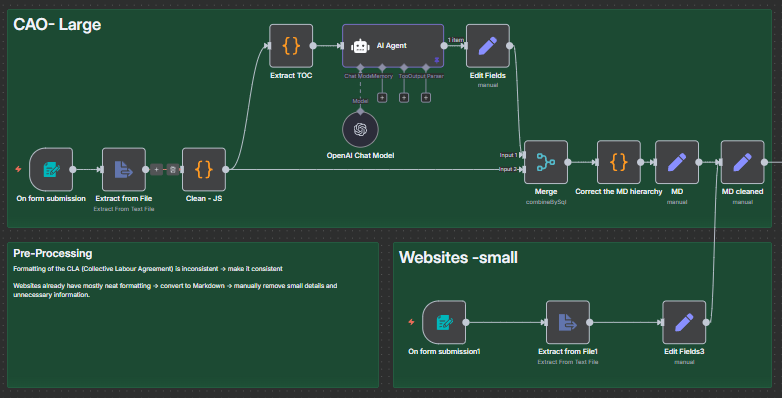

# N8N_AI_AGENT_RAG

> **Demo:** [Demo Chatbot](https://preview--alexchanrag-test.lovable.app/)

An n8n + OpenAI + Supabase RAG Agent for intelligent document Q&A, designed by **Alex Chan (@AlexZZ2K)**.

**Important Notice: Testing and Educational Purposes Only
The outputs and responses provided by this AI chatbot are generated for testing and experimental purposes only. These responses do not represent verified facts, professional advice, or authoritative information. **

---

## 🧭 Overview

This project implements a full **Retrieval-Augmented Generation (RAG)** workflow for intelligent question answering over structured and unstructured text sources, such as CAO documents and policy PDFs.

Built in **n8n**, the pipeline performs end-to-end ingestion, cleaning, chunking, embedding, retrieval, and AI response generation — all with automated meta-logging.

---

## ⚙️ Workflow Phases

### 1️⃣ Pre-Processing Phase
- Input: PDF or website content
- Parsing via **LlamaParser** and Markdown conversion
- Manual cleanup and post-formatting
- Output: unified Markdown text for downstream processing
 

### 2️⃣ Chunking & Embedding Phase
- Hierarchical chunking based on headings (#, ##, ###)
- Each chunk gets a short contextual summary via LLM
- Stored as vector embeddings in **Supabase Vector Store**
- Supports contextual retrieval (Anthropic-style)
  

### 3️⃣ AI Agent & Logging Phase
- User submits a query via webhook/form
- Metadata logged: language, consent, topic
- RAG Agent retrieves top chunks and forms answer
- Logs success/fallback data (human help = TRUE/FALSE)
- After 3 failed replies → escalate to human agent
  

---

© 2025 – Built by **Alex Chan**  
GitHub: [@AlexZZ2K](https://github.com/AlexZZ2K)
