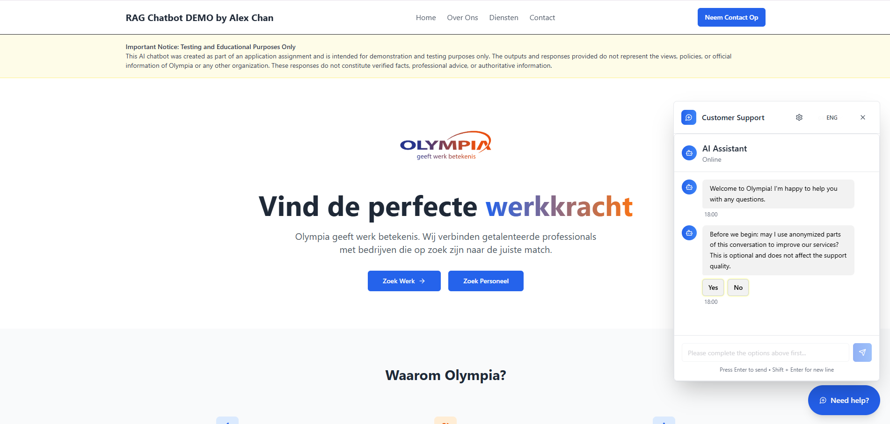
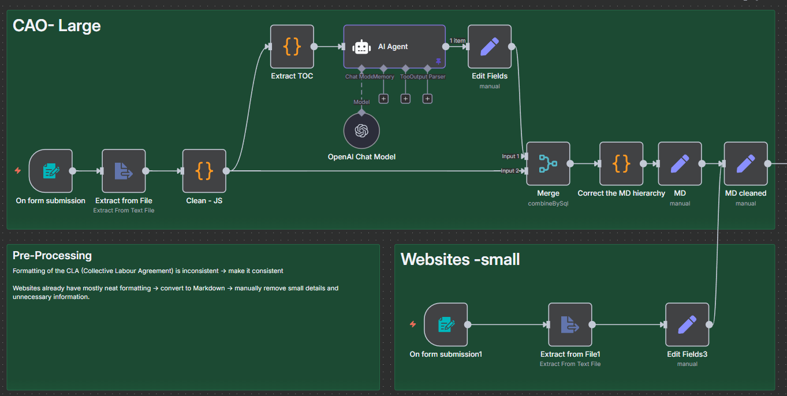
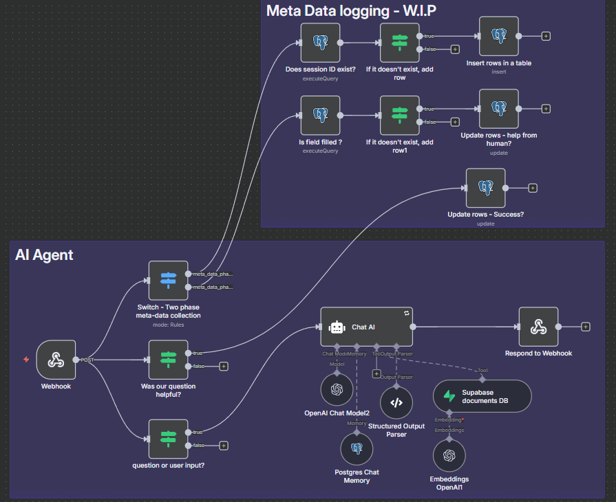

# N8N_AI_AGENT_RAG

> **RAG based AI Agent Demo:** [click here to try it out](https://preview--alexchanrag-test.lovable.app/)

An n8n + OpenAI + Supabase RAG Agent for intelligent document Q&A, designed by **Alex Chan (@AlexZZ2K)**.

>**Important Notice: Testing and Educational Purposes Only
This AI chatbot was created as part of an job application assignment and is intended for demonstration and testing purposes only. The outputs and responses provided do not represent the views, policies, or official information of Olympia or any other organization. These responses do not constitute verified facts, professional advice, or authoritative information.**

---

## 🧭 Overview

This project implements a full **Retrieval-Augmented Generation (RAG)** workflow for intelligent question answering over structured and unstructured text sources, such as CAO documents and policy PDFs.

Built in **n8n**, the pipeline performs end-to-end ingestion, cleaning, chunking, embedding, retrieval, and AI response generation — all with automated meta-logging.

---

## ⚙️ Workflow Phases

### 1️⃣ Pre-Processing Phase
- Input: PDF or website content
- Parsing via **LlamaParser** and Markdown conversion
- Manual cleanup and post-formatting
- Output: unified Markdown text for downstream processing
 

### 2️⃣ Chunking & Embedding Phase
- Hierarchical chunking based on headings (#, ##, ###)
- Each chunk gets a short contextual summary via LLM
- Stored as vector embeddings in **Supabase Vector Store**
- Supports contextual retrieval (Anthropic-style)
    

### 3️⃣ AI Agent & Logging Phase
- User submits a query via webhook/form
- Metadata logged: language, consent, topic
- RAG Agent retrieves top chunks and forms answer
- Logs success/fallback data (human help = TRUE/FALSE)
- After 3 failed replies → escalate to human agent
  

---

© 2025 – Built by **Alex Chan**  
GitHub: [@AlexZZ2K](https://github.com/AlexZZ2K)
